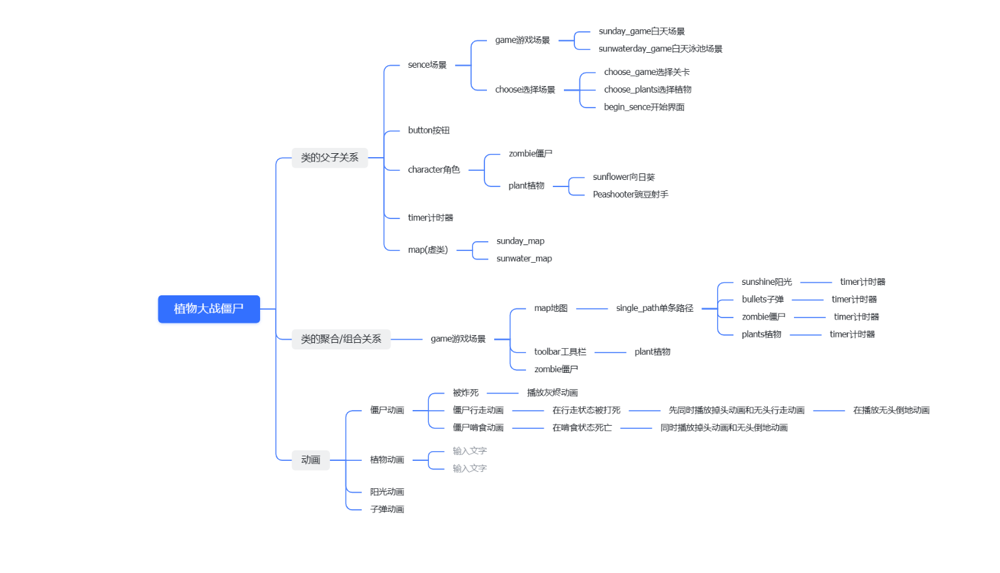

###### 项目简介

该项目是南京大学2024高级程序设计的大项目作业

项目制作者：谷兆丰

项目名称：植物大战僵尸

##### 游戏教程

在放置植物卡片状态时，按鼠标右键可以取消

##### 组织架构

###### 项目特点

动态延时：主循环中不做任何延时操作，保证游戏流畅度和鼠标跟手性，播放动画的任意帧直接与时间关联，使无论在任何负载的情况下，动画帧率都能保持稳定

僵尸的运动采取变速运动，基本解决了问题

计时函数使用inline关键字，减少调用函数开销造成的时间误差

##### 印象深刻的已解决的问题

1 用基于范围的for迭代时少写&导致访问的是副本

2 函数没写返回值导致报错（返回值不写不报黄）
